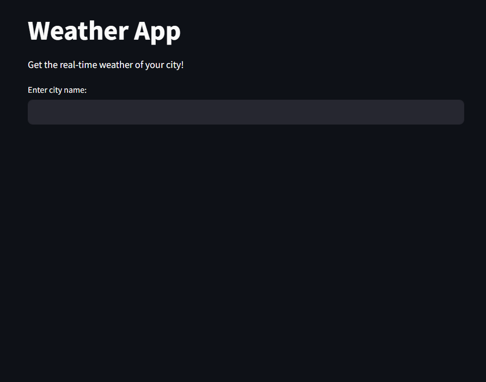
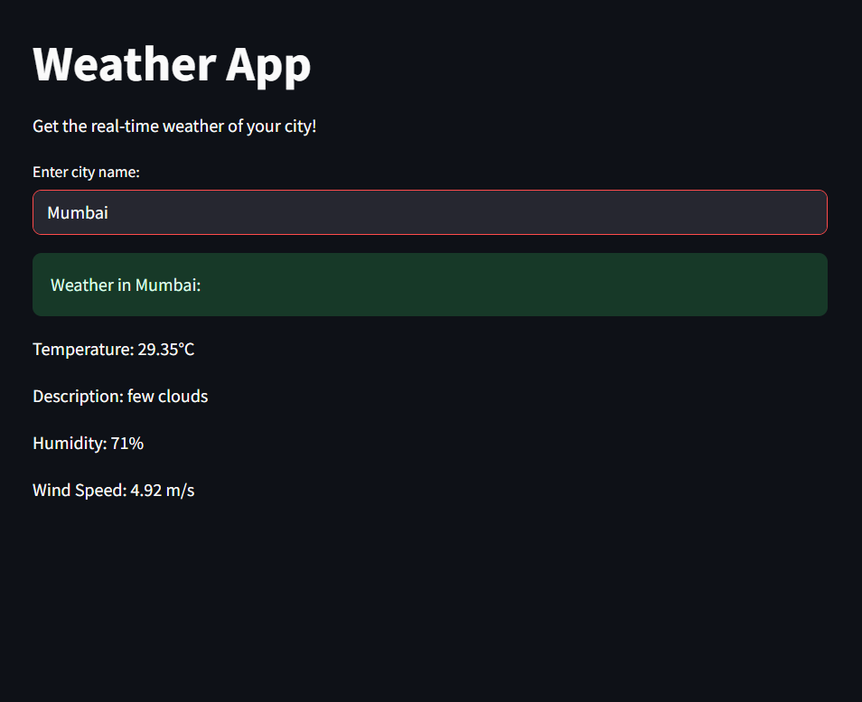

# Weather App

A simple and elegant web app built with **Straemlit** and **OpenWeatherMap API** to obtain real-time weather updates for any city in the world.

---

## Features

- Current temprature in Celsius
- Weather Description
- Humidity levels
- Wind Speed
- Built with python

---

## How to Run locally


1. **Clone the repository**

``` bash 
git clone https://github.com/Sakshamnagar-7227/weather-app.git
cd weather-app
```

2. **Install Dependencies**

pip install -r requirements.txt

3. **Set Your Own OpenWeatherMap API key**

api_key = "your_key"

4. **Run the app**

streamlit run app.py

---
<div>
  
  
</div>
Made with ❤️ by Saksham